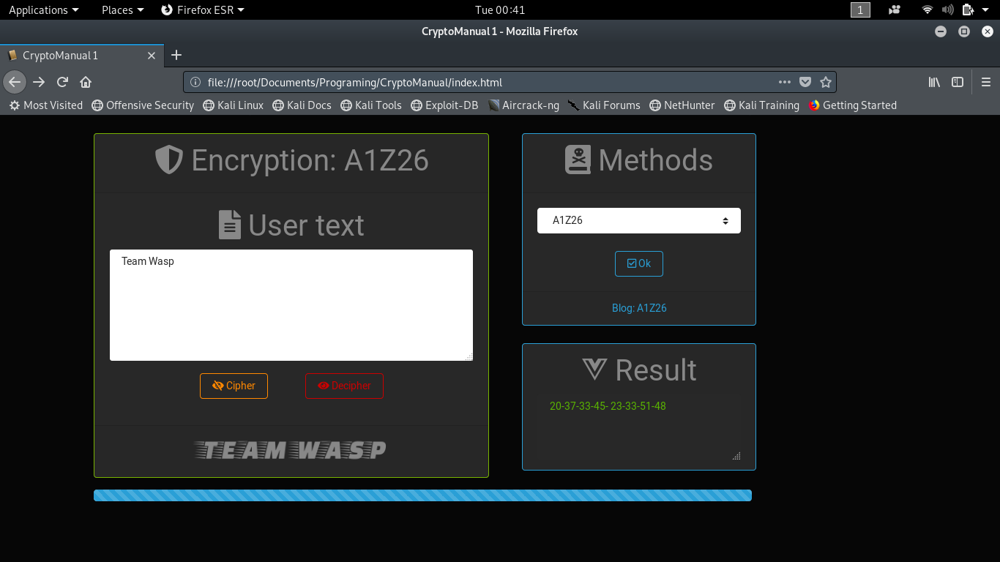
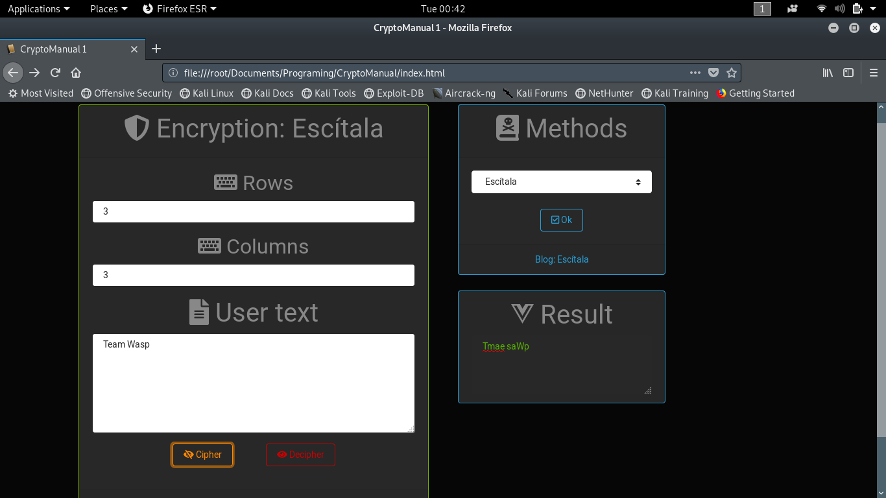
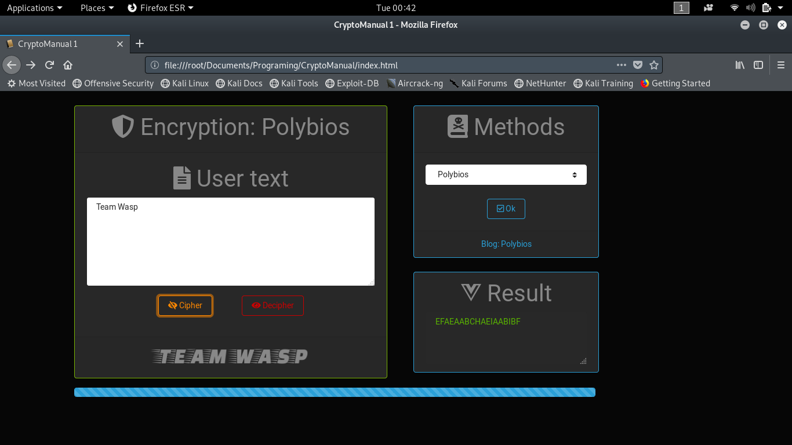
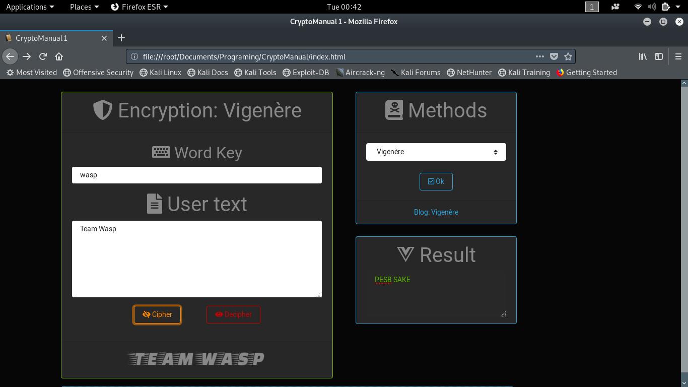
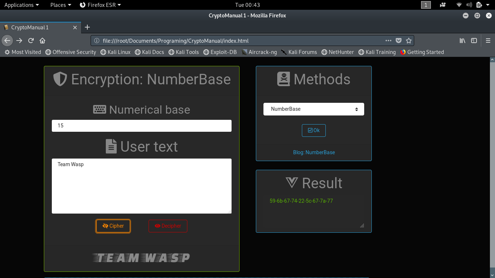
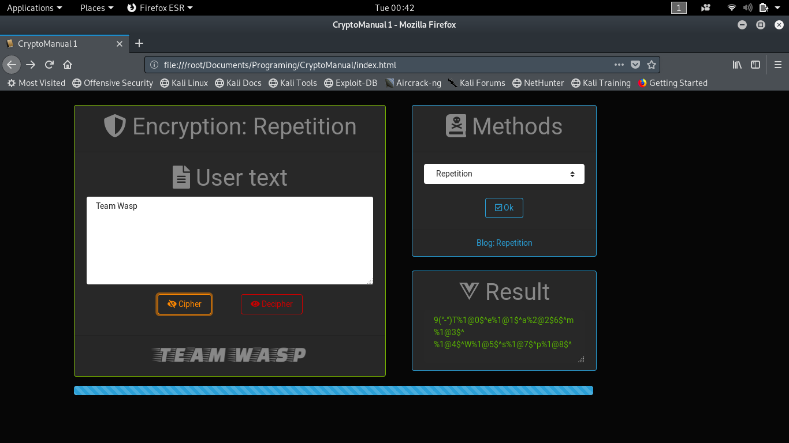
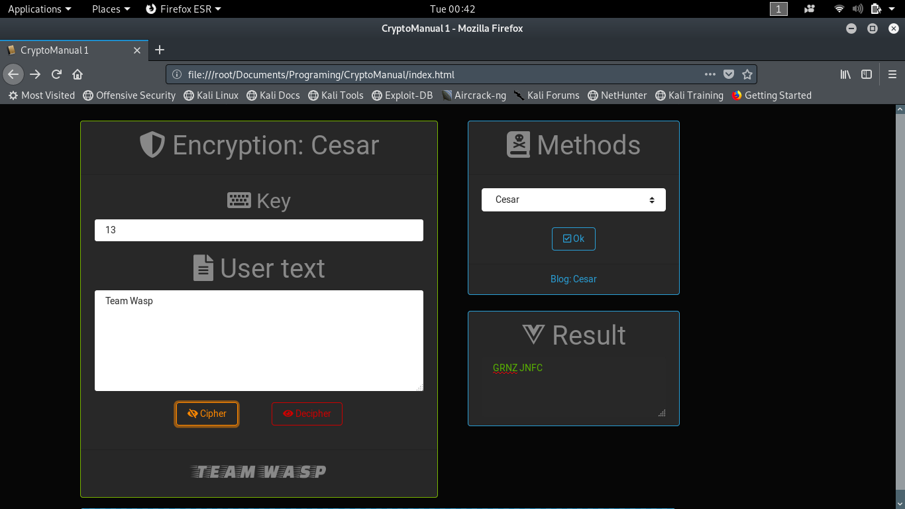

# Crypto Manual 1 - 100% finished

# Classic encryption

> 'A1Z26': Team Wasp -> 20-37-33-45- 23-33-51-48

> 'ROT13': Team Wasp -> GRNZ JNFC

> 'Atbash': Team Wasp -> GVZN DZHK

> 'Escítala': Team Wasp (3x3) -> Tmae saWp

> 'Polybios': Team Wasp -> EFAEAABCHAEIAABIBF

> 'Vigenère': Team Wasp (wasp) -> PESB SAKE

> 'Number Base': Team Wasp (15)-> 59-6b-67-74-22-5c-67-7a-77

> 'Reverse': Team Wasp -> psaW maeT

> 'Repetition': Team Wasp -> 9(°-°)T%1@0$^e%1@1$^a%2@2$6$^m%1@3$^ %1@4$^W%1@5$^s%1@7$^p%1@8$^

> 'Cesar': Team Wasp (13) -> GRNZ JNFC

# Team Wasp

